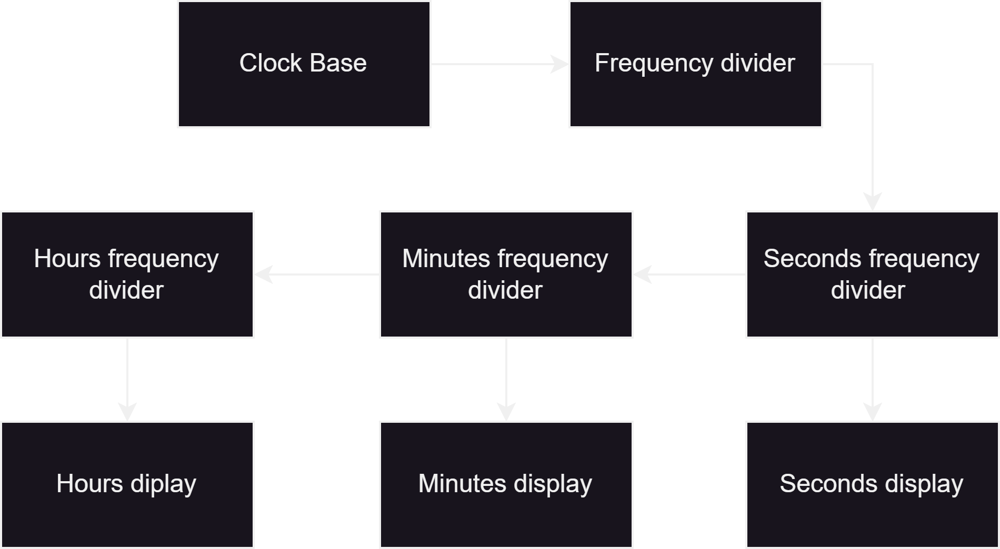
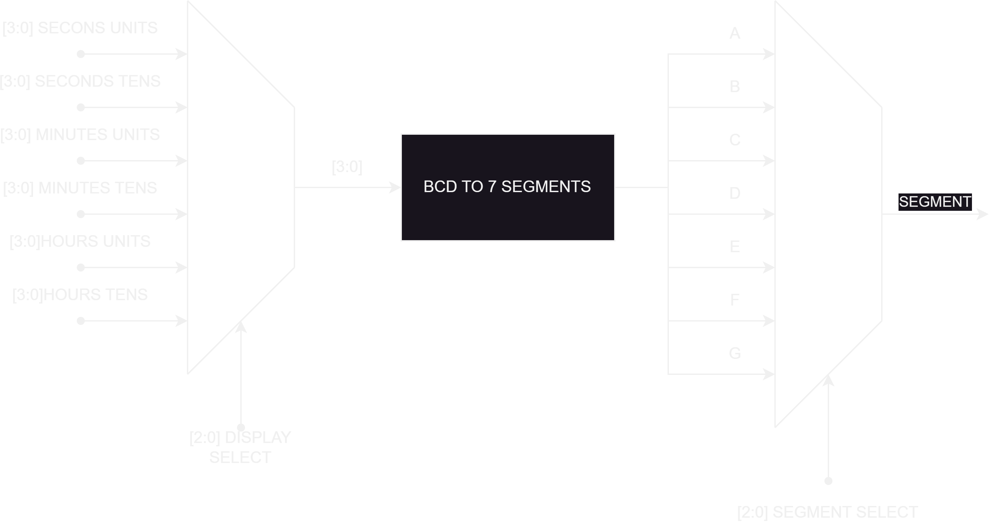

  

# A clock based on seven segments displays 

The heart of this project is a 7-segment clock that provides the display of hours, minutes, and seconds in a clear and readable format. With the ability to choose between a 12-hour or 24-hour format, users have complete control over how they want to perceive time. This feature is especially useful for those who prefer the convenience of one format or the precision of another.

However, customization doesn't stop there. This clock puts the power of choice in the hands of the users by allowing them to select whether they want the displays to be of common anode or common cathode type. This feature is crucial as it provides flexibility in the clock interface and caters to the individual preferences of each user.

Programming this clock is as intuitive as it is powerful. Equipped with two buttons, the user can navigate through the configuration menu and adjust the time accurately and easily.

## Architecture

The design of the clock is based on a scheme similar to the one illustrated in Figure 1. Since the available resources are limited, the decision was made to implement 2 cascading frequency dividers. The first divider, with a ratio of 5000 to 1, generates the clock signal used for segment scanning and also serves as the input for the second frequency divider, which operates at a ratio of 2000 to 1. Together, these two cascading dividers generate a total ratio of 10,000,000 to 1. This ratio is particularly useful considering that the base clock frequency is 10MHz, resulting in a 1Hz signal used to synchronize the movement of the clock's second hand.

With the aim of optimizing space, the decision was made to employ multiplexing instead of implementing a Binary-Coded Decimal (BCD) to 7-segment display converter for each of the clock's digits. Through this multiplexing technique, the display to be shown at a given moment is selected, which in turn reduces the number of output pins needed to control the displays. This becomes especially advantageous since the maximum number of available pins is 8.

Despite the proposed multiplexing strategy for the output ports, the total number of pins required for this configuration remains high. To address this limitation, a configuration was chosen where bit scanning is performed (see figure 2). In other words, at each moment in time, only one segment is turned on, resulting in a dimming of each segment's brightness due to its intermittent activation.

This intermittent lighting feature allows for keeping the use of pins to a minimum, albeit with the trade-off that the segments will not be continuously lit.

## GPIO Pins.

The input and output pins play crucial roles in the functionality of the clock, contributing to its operation and configuration. Below is the function assignment for each of the pins:

Input Pins: 

- disp_type: This pin is used to select the type of display to be used with the clock, whether it is Common Anode or Common Cathode.
- fmt: This pin is used to select the display format of the clock. A specific value could indicate the 12-hour format or the 24-hour format, allowing users to choose their preferred representation.
- prog: This "prog" pin could be used to activate a programming mode in the clock, enabling the configuration and adjustment of different parameters, such as the current time or clock settings.
- adjust: The "adjust" pin could be used to activate the adjustment mode, allowing users to adjust the hour, minutes, or other clock-related settings.

Output Pins: 

- AM/PM: This output pin indicates whether it is AM or PM in the 12-hour format. It facilitates the distinction between morning and afternoon in the time display.
- segments: The "segments" pin controls the activation of individual segments in the 7-segment displays. By manipulating this pin, the necessary segments are turned on or off to form digits and characters on the displays.
- display_select [4:2]: These output pins determine which display should be activated at a given moment in the multiplexed configuration. Different values of these pins will select the specific digit to be displayed at that instant.
- segment_select [7:5]: These pins control the selection of segments within the active display. By changing the values of these pins, specific segments are activated or deactivated, allowing for the display of different numbers and characters on the clock.

The function assignment to these input and output pins is essential to ensure proper operation and an effective user interface in the clock. Each pin plays a unique role in the configuration and operation of the clock, enabling users to interact with it intuitively and accurately.

## How can i program it

The programming process of the clock involves the use of the "prog" button. In its standard operating mode, the clock will display numbers on all segments. However, when the programming mode is activated, the displays of all digits except the ones being adjusted will turn off. The adjustment of time units is carried out by pressing the "adjust" button at specific moments. The order of adjustment is seconds, minutes, and hours. Once the hours have been adjusted, the clock will return to its normal operating mode.

This process can be described as follows:

  1.-Normal Operating Mode:
  
  - In this mode, the clock displays numbers on all segments, indicating the current time.
  - The "prog" and "adjust" buttons are in their standard state and have no special function.

  2.-Entering Programming Mode:
  - To enter programming mode, the "prog" button must be pressed.
  - Once programming mode is activated, all displays turn off except those related to the time unit being adjusted.

  3.-Adjustment of Time Units:
  - To adjust time units (seconds, minutes, or hours), the desired unit to be adjusted must first be selected. This selection could be done through a selection process using the "prog" and "adjust" buttons.
  - Once the time unit is selected, the displays corresponding to that unit will remain on.
  - Pulses of the "adjust" button are used to increase the value of the time unit being worked on.

  4.-Adjustment Order: Seconds, Minutes, and Hours:
  - The adjustment process is done in the following order: seconds, minutes, and then hours.
  - Each time an adjustment is completed, the displays related to that time unit turn off, and the process moves to the next unit.

  5.-Completion of Hour Adjustment:
  - Once the hour unit has been adjusted, the clock will automatically return to its normal operating mode.
  - The displays will again show the current time on all segments.

This programming process allows users to accurately adjust the clock's time units using the "adjust" button in conjunction with the "prog" button to navigate between different time units.
 
## How can i use it?

To ensure proper functionality, it is necessary to implement the circuit depicted in Figure X. The goal is to perform a demultiplexing operation on the ports.

# Acknowledgment
